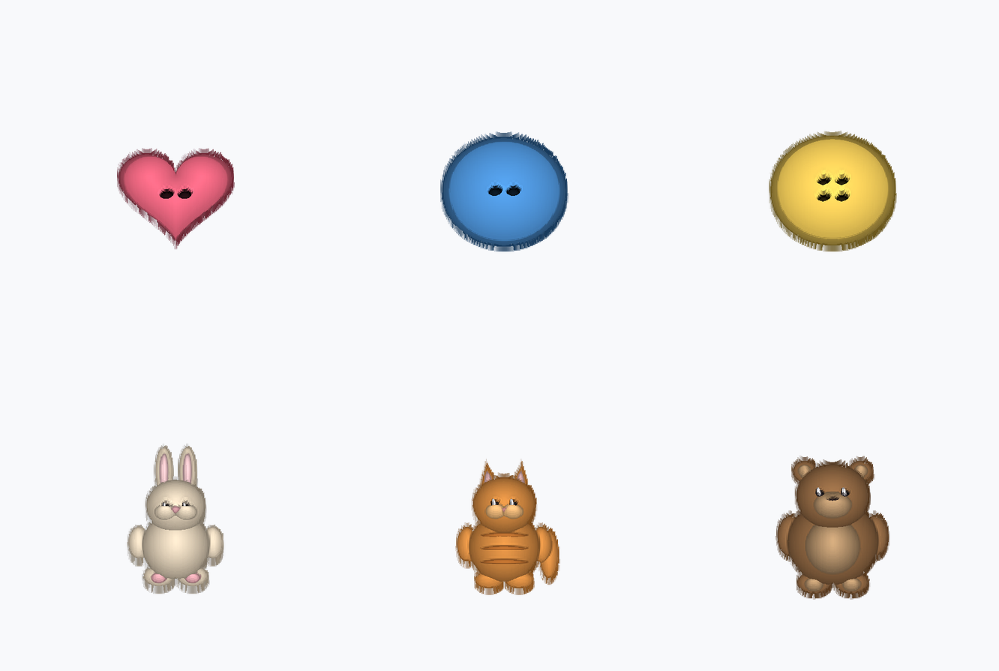

# Plush Toys & Buttons — an Omni3D asset set

A small, cohesive game-asset pack built with the **omni3d** skill's free local
generation engine — **6 watertight, textured, engine-ready `.glb` solids**, all
produced **GPU-free** on CPU.

| | Plush characters | Button props |
|---|---|---|
| | 🧸 teddy bear · 🐰 bunny · 🐱 ginger cat | 🔵 round 2-hole · 🟡 round 4-hole · 💗 heart 2-hole |



## How they were built (the pipeline)

```
build_refs.py            omni_engine.cli mesh            preview.py
PIL procedural   ──▶     --model relief          ──▶    matplotlib 3D
reference PNG            (luminance height field)        preview + sheet
(plain bg, soft         → watertight textured            (faithful render
 radial shading)          SOLID .glb                      of the relief)
```

1. **Reference** — `build_refs.py` renders each subject on a plain background with
   soft, distance-transform *doming* (bright at each form's centre, dark at the
   edge). That's exactly the cue the relief mesher turns into 3D.
2. **Mesh** — `omni_engine.cli mesh --model relief` isolates the subject from its
   background and lifts luminance into a height field, exporting a **watertight,
   UV-textured solid** (front relief + flat back + side walls) — opens directly in
   Blender / Unreal Engine 5 / Unity at **1 unit = 1 cm**.
3. **Preview** — `preview.py` reconstructs the same field and renders a true-colour
   3D view of each asset (headless, no display) plus the contact sheet above.

Reproduce the whole set:

```bash
bash build.sh          # refs → .glb solids → previews   (uses the engine venv)
```

## What's in here

```
build_refs.py     procedural reference generator (PIL + numpy + scipy)
preview.py        headless 3D preview renderer (matplotlib)
build.sh          one-command reproduce: refs → meshes → previews
manifest.json     per-asset stats (verts/faces/watertight/bbox/bytes)
refs/             input reference images (6 × 1024²  PNG)
previews/         3D preview renders + _contact_sheet.png
assets/           output .glb solids — git-ignored (≈2 MB each); run build.sh
```

Every mesh is **73,728 vertices**, **watertight**, **winding-consistent**, with a
positive volume and an embedded texture — see `manifest.json` for exact counts.

## Honest scope (what ran, what didn't)

- ✅ **Verified here, GPU-free:** procedural refs → `relief` mesher → 6 real
  watertight textured `.glb` solids; 3D previews; engine unit tests 10/10 green.
- ⏳ **Higher-fidelity meshing** (`--model depth` MiDaS, or `triposr` / `trellis`)
  needs `torch`/`timm` (depth) or a CUDA GPU (TripoSR/TRELLIS). `--model auto`
  uses them when present and falls back to `relief` otherwise.
- ⏳ **Full production pipeline** (`scripts/omni3d_drive.sh` → retopo → auto-rig →
  motion retarget → EITL validation, UE5/Unity live-sync) clones the
  `Kariimc/Omni-3d` repo, which was **outside this session's repo scope** (clone
  returned 403), so that TypeScript pipeline wasn't exercised in this run. Per the
  skill it returns an `asset://` manifest, not finished files — the real `.glb`
  output comes from the engine used above.

## Use / extend

- **Open the meshes:** drag a `.glb` from `assets/` into Blender, UE5, or Unity.
- **Add a character/button:** add an entry to `SUBJECTS` in `build_refs.py`
  (compose `paint(...)` puffs / polygons), then `bash build.sh`.
- **Photoreal references instead of procedural:** generate a plain-background image
  per subject with an image model (e.g. Higgsfield `generate_image`), drop it in
  `refs/`, and mesh it the same way — the relief/depth backend consumes any image.
```bash
# e.g. once you have a real reference image:
python -m omni_engine.cli --backend real mesh refs/my_plush.png -o assets/my_plush.glb --model auto
```
